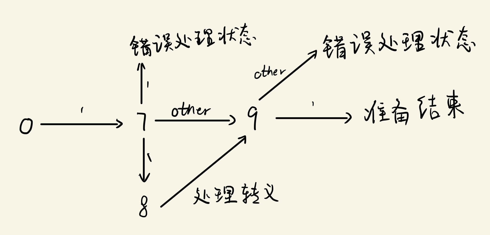
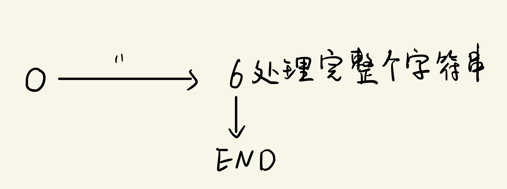
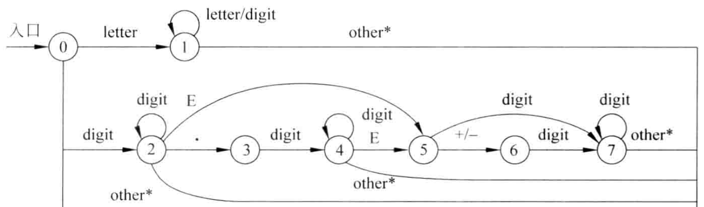

# c语言词法分析器实现

## 软件环境

- macOS Big Sur
-  Apple clang version 13.0.0
- flex 2.6.4 Apple
- GNU Make 3.81
- cmake version 3.23.2

---

## c语言手写词法分析器

由于完整的c语言词法分析器较为繁杂，在实现时只考虑实现了c语言完整词法分析的一个子集。该实现能识别如下token

### 关键字

参照ISO/IEC 9899:1999 ，c语言中的关键字罗列如下

```c
auto break case char const continue default do double else enum extern
float for goto if inline int long register restrict return short signed
static struct switch typedef union unsigned void volatile while sizeof
_Bool _Complex _Imaginary
```

由于关键字数量过多，现去掉了其中一小部分关键字，在程序中识别如下的关键字

```c
auto break case char const continue default do
double else enum extern float for goto if 
int long register return short signed sizeof static 
struct switch typedef unin unsigned void volatile while
```

### Punctuators

参照ISO/IEC 9899:1999，c中规定的punctuators罗列如下

```c
[ ] ( ) { } . ->
++ -- & * + - ~ !
/ % << >> < > <= >= == !=  ^  |  && ||
?  :  ;  ...
= *= /= %= += -=  <<=  >>=  &=  ^=  |=
,  #  ##
<: :>  <%  %>  %:   %:%:
```

在程序实现中，我选取了其中常用的一部分进行识别，罗列如下

```c
[ ] { } ( ) . & * + - ~  ! / % < > ^ | ? : ; = ,
-> ++ -- << >> <= >= == != && ||  *= /= %= += -=
```

### identifier

在我的实现里面，标识符的格式\[a-zA-z_ \]\[a-zA-Z0-9_ \]*，符合该格式的字符串都识别为标识符。 

### string

现在的实现可以识别如下两种形式的字符串

```c
"fneinf fneiowe "   // 由两个引号包裹的字符串
// 以下为第二种形式，多个字符串中间只有空白符，拼接为一个字符串
"abcd""efg"  "hij"   // 该字符串等同于"abcdefghij" 
```

c语言字符串中有较多种转义字符，全部实现较为繁杂，在目前的实现中支持如下转义

```c
\n  \r  \t  \0  // 这几种转义实现了
  
// 碰到其它的转义则直接忽略 \
// 如 "ab\cd" 等同于 "abcd"
// 不支持 \777 \xff 这种转义
```

### char

程序可以识别形如`'x'`的字符，转义处理与前一节中的string类似。

### number

在现在的实现中，程序可以识别十进制的整数、十六进制的整数、八进制的整数，十进制的小数，可以识别科学计数法形式的小数。

### 实现

#### 数据结构定义

将与词法分析有关的信息封装到如下结构体中

```c
typedef struct lex {
    FILE *lex_in; // input file
    int token;    // current token
    token_value val; // token value
    dict symbols;    // symbol table

    int cur_ch;   // current char
    char text[MAX_TOKEN_TEXT_LEN + 1]; // text corresponding with the token
    char *text_ptr; // point to the next position to write in text

    int line; // line number
    int pos;  // position in current line
    int token_pos; // position before scanning current token
    int token_line;  // line number before scanning current token
    int num_ch; // number of chars read

    char err_msg[LEX_MAX_STR_LEN + 1]; // only used when token is ERROR
} lex;
```

其中`lex_in`为输入文件，`token`为上一次扫描输入得到的标记，`token`可能的取值如下，为了使用方便，在我的实现中，`keywords`直接作为一个`token`，因为只需要一个`token`值便可以标识唯一的关键字，若采用\<keyword,while\>这种形式来标识`token`显得更为麻烦。

```c
typedef enum token{
    // [ ] { } ( ) . & * + - ~  ! / % < > ^ | ? : ; = ,
    // 这些只有一个符号的直接用ascii码当成token
    // -> ++ -- << >> <= >= == != && ||  *= /= %= += -=

    // >= 256 防止出现ascii 码中的数字
 ARROW=256,INC,DEC,LEFT_SHIFT,RIGHT_SHIFT,LE,GE,EQ,NE,AND,OR,MUL_ASSIGN,DIV_ASSIGN,MOD_ASSIGN,ADD_ASSIGN,SUB_ASSIGN,
    // 上面的都是punctuator
    AUTO,BREAK,CASE,CHAR,CONST,CONTINUE,DEFAULT,DO,
    DOUBLE,ELSE,ENUM,EXTERN,FLOAT,FOR,GOTO,IF,
    INT,LONG,REGISTER,RETURN,SHORT,SIGNED,SIZEOF,STATIC,
    STRUCT,SWITCH,TYPEDEF,UNION,UNSIGNED,VOID,VOLATILE,WHILE,
    // 以上为关键字
    ID, // identifier
    STR,INTEGER,DECIMAL,CHARACTER,
    // error token
    ERROR,
}token;
```

`token`为上一次扫描时得到的`token`，`val`中放着某些`token`的属性值（有些token 不需要属性值，只需要token就可以标识是什么，而有些token则需要value，比如字符串，标识符，数字等等）。

`symbols`为符号表，底层实现为一颗字典树，详见下文。

`cur_ch`即current  character ，即向前看的字符，状态机通过看该字符决定该进入哪一个状态。

`text`功能同`lex`中的`yytext`，即每一次扫描后记录着该次扫描到的`token`对应的输入文件中的字符串。

`text_ptr`为辅助变量，用于填充`text`。

`line  pos  token_pos  token_line  ch_num`分别为当前lex所处的输入文件中的行，当前所处输入文件中的列，上一次扫描到的`token`开头所处的行列，当前读入字符个数。

`err_msg`为出现错误时的提示信息。

---

下面看看`token_val`的定义

```c
#define ID_TYPE 0
#define STRING_TYPE 1
#define INT_TYPE 2
#define DECIMAL_TYPE 3
#define CHAR_TYPE 4

typedef struct token_value {
    int type;                          // one of macros defined above
    union {
        int ch;                        // CHAR_TYPE
        int integer;                   // INT_TYPE
        double decimal;                // DECIMAL_TYPE
        char str[LEX_MAX_STR_LEN + 1]; // STRING_TYPE
        void *data;                    // ID_TYPE   this is the entry in symbol table
    } value;
} token_value;
```

`type`标志着该`value`是什么类型的值，`str_ptr`指针只有在处理到字符串时使用，用于填充`str`，`value`为一个union，内部详见上面代码以及注释。

#### 相关的函数

为操作上一小节描述的结构体，我实现了如下两个函数

```c
int init_lex(char *file_name,lex *l);

int next(lex *l);
```

- `init_lex`:初始化一个lex结构体，file_name为输入文件名，l为待初始化的lex结构指针。
- `next`:从输入文件中扫描下一个`token`，返回值为扫描到的`token`，该值也会存于`l->token`中，调用该函数后，l内部的各个成员值都会更新。

---

#### 状态机的设计

在设计状态机时，为了防止一个函数书写代码过长，我将状态机的每个状态用一个函数表示。定义函数指针类型如下

```c
typedef int (*func)(lex *);
```

上述代码中定义的类型`func`即为函数指针，指向原型为`int state_name(lex *)`的函数。我使用一个指针数组来存放对应各个状态的函数，如下

```c
static func states[128] = {
        state0, state1, state2, state3, state4, state5, state6,state7,state8,state9,state10,state11,
        state12,state13,state14,state15,state16,state17,state18,state19,
};
```

有了`states`数组，运行状态机的方式如下代码所示

```c
#define END_STATE -1

int next(lex *l) {
    int state = 0;  // initial state is 0

    ... // do something
      
    while ((state = states[state](l)) != END_STATE) {
        ... // do something 
    }
    return l->token;
}
```

`states`中存放着各个状态对应的处理函数，处理函数会根据当前的输入返回下一个状态，直到碰到终止状态为止。

---

#### 标识符与关键字

在一些资料中看到，有些词法分析器直接区分关键字与标识符，而另外一种做法是将关键字与标识符一视同仁，不加区分，关键字与标识符都会放入符号表中，而符号表内有将两者加以区分的信息，词法分析器在初始化时将关键字提前放入符号表中并标明其信息，扫描到关键字或标识符时会通过符号表加以区分。

##### 符号表的内部实现

符号表应当能完成从字符串到值的映射，为了实现该目的，我手写了一个简单的字典树来完成该需求。其中字典树相关结构定义如下

```c
#define TRIE_NEXT_LEN 128

typedef struct node{  // 字典树节点
    void *data;       // 存放的数据  若无则该指针为NULL 且size为0
    size_t size;      // data指向数据的大小

    struct node *children[TRIE_NEXT_LEN];   // 子节点
}trie_node;

typedef trie_node *dict;  // dict类型即节点指针
```

为字典树定义了一系列函数方便对其操作，列举如下

```c
dict new_dict();  // 创建一颗字典树

void *trie_insert(dict d,char *key,void *data,size_t size);  // 以key为键，插入一块数据

int get_key_data(dict d,char *key,void *data);  // 查找一块数据，找到返回1，并将数据复制到data

int key_in(dict d, char *key);   // 判断key是否在一颗字典树上
  
void *get_key_data_ptr(dict d,char *key);  // 直接获取树节点内部的data指针

void destroy_trie_tree(dict d);            // 销毁字典树
```

各个函数详细实现见源代码，再次不详述。

---

##### 符号表的初始化

如上文所述，我的程序在状态机中不区分标识符与关键字，而是把标识符与关键字都当做symbol，关键字在lex初始化时预先放入了符号表中。符号表中每一项条目定义如下

```c
// stored in symbol table
typedef struct item{
    int token;   // exact keyword or ID

    // other field not defined yet
}item;
```

其中`token`字段即标识了该符号具体是什么`token`，例如`while`在符号表中的`token`字段为`WHILE`。目前符号表中并没有其余的条目，由于暂时不考虑生成代码，故当前符号表中的一项内只有`token`字段。在`lex`结构的`init`函数内初始化符号表代码如下

```c
// insert build-in symbols (keywords) into the symbol table
void insert_buildin_symbols(lex *l) {
    item data;
    data.token = AUTO;
    trie_insert(l->symbols, "auto", &data, sizeof(data));
    data.token = BREAK;
    ...  // omitted
    trie_insert(l->symbols, "unsigned", &data, sizeof(data));
    data.token = VOID;
    trie_insert(l->symbols, "void", &data, sizeof(data));
    data.token = VOLATILE;
    trie_insert(l->symbols, "volatile", &data, sizeof(data));
    data.token = WHILE;
    trie_insert(l->symbols, "while", &data, sizeof(data));
}

int init_lex(char *file_name, lex *l) {
    if ((l->lex_in = fopen(file_name, "r")) == NULL)
        return -1; // failed to open file

    l->cur_ch = getc(l->lex_in);  // read first char

    if ((l->symbols = new_dict()) == NULL) { // fail to create symbol table
        fclose(l->lex_in);
        return -1;
    }

    l->text_ptr = l->text;

    l->line = 1;
    l->pos = 1;
    l->num_ch = 0;

    insert_buildin_symbols(l);  //  put keywords into symbol table

    return 1;
}
```

##### 状态机

识别关键字和标识符的状态机如下所示

```
0----letter or _ --> 1 ---+-- epsilon --> end
                     ^    |
                     |    | 
    letter or _ or number | 
                     +----+
```

相关代码如下

```c
// used to comsume current character and read next character from input file
#define NEXT_CHAR(l) do{*(l->text_ptr ++) = l->cur_ch;l->cur_ch = getc(l->lex_in);}while(0)

int state0(lex *l) { // initial state
    if (IS_LETTER(l->cur_ch) || l->cur_ch == '_') { // ID    goto state 1
        NEXT_CHAR(l);
        return 1;
    }
    ... // omited
}

int state1(lex *l) { // state to read an ID
    item entry;
    item *tmp;
    if (IS_LETTER(l->cur_ch) || IS_NUMBER(l->cur_ch) || l->cur_ch == '_') {
        *(l->text_ptr++) = l->cur_ch;
        l->cur_ch = getc(l->lex_in);
        return 1;
    } else {
        *l->text_ptr = 0;
        l->text_ptr = l->text;
      	// if symbol is already in symbol table
        // return token store in symbol table directly
        if ((tmp = get_key_data_ptr(l->symbols, l->text)) != NULL)
            l->token = tmp->token;
        else {
          	// not in symbol table
            // add an entry to the symbol table
            // token is ID
            l->token = entry.token = ID;
            tmp = trie_insert(l->symbols, l->text, &entry, sizeof(entry));
        }

        l->val.type = ID_TYPE;
        l->val.value.data = tmp; // entry to symbol table

        return END_STATE;
    }
}
```

在状态1时，不停读入字母、下划线或数字，直到碰到第一个不是字母、数字、下划线的为止，然后在符号表中查询该符号，若已经存在，依据符号表中的token设置token，若不存在，则将为新符号创建条目加入符号表，token为ID,属性值即为符号表对应表项数据的首地址。

#### 跳过空白符

状态机的起始状态为0,若要跳过空白符，只需要在碰到空白符时依旧回到状态0即可，状态机表示如下

```
0--- white space --+
^                  |
|                  |
+------------------+
```

对应代码如下

```c
int state0(lex *l) { // initial state
    ...

    if (IS_WHITE_SPACE(l->cur_ch)) { // skip white space
        l->cur_ch = getc(l->lex_in);
        return 0;
    }
  
  	...
}
```

#### punctuator

如前文所述，我实现的词法分析器支持的punctuator如下

```c
[ ] { } ( ) . & * + - ~  ! / % < > ^ | ? : ; = ,
-> ++ -- << >> <= >= == != && ||  *= /= %= += -=
```

其中双字符的punctuator需要向前看一个字符才能确定，在state0中若碰到双字符的punctuator的第一个字符则转到状态2进行判断，如下

```c
static int is_in(int ch, char *s) { // check if ch in s
    while (*s != 0)
        if (ch == *s++)
            return 1;
    return 0;
}

int state0(lex *l) { // initial state
    ...

    // multi-char punctuators
    // need to look ahead
    if (is_in(l->cur_ch, "&*+-!/%<=>|")) {
        l->token = l->cur_ch;
      // store current char so next state can decide which punctuator it is
        NEXT_CHAR(l);
        return 2;
    }
  
  	...
}
```

state2中的主体代码形式如下，`l->token`为`state0`中记录的第一个字符。

```c
int state2(lex *l){
  	...
    switch (l->token) {
          case '&':
              if (l->cur_ch == '&') {
                  mul_char = 1;
                  l->token = AND;
              }
              break;
          case '*':
              if (l->cur_ch == '=') {
                  mul_char = 1;
                  l->token = MUL_ASSIGN;
              }
              break;
      ...
  }
}
```

##### 特殊情况

在处理punctuator时可能会碰到注释，即`//` 和`/*`这两种情况，碰到行注释和块注释分别进入状态4、5进行处理，代码如下

```c
int state2(lex *l){
  	...
    switch (l->token) {
          case '/':
            if (l->cur_ch == '=') {
                mul_char = 1;
                l->token = DIV_ASSIGN;
            } else if (l->cur_ch == '/') { // line comment
                l->text_ptr = l->text;
                l->cur_ch = getc(l->lex_in);
                return 3;
            } else if (l->cur_ch == '*') { // block comment
                l->text_ptr = l->text;
                l->cur_ch = getc(l->lex_in);
                return 4;
            }
            break;
      ...
  }
}
```

相关状态如下，在跳过所有注释后返回到状态0重新开始扫描token.

```
0--- / --->2--- / ---> 3
					 |
					 +--- * ---> 4


                    +------other------+----------+
                    |                *|          |
+----	\n-->0				+->4 --+--- * --->5----------+
|                      ^   |          |
3-- other --+          |   other      +-- / ---->0
^           |          +---+
+-----------+
```

依据状态转移图书写代码如下

```c
// skip line comment
int state3(lex *l) {
    int tmp_ch = l->cur_ch;
    l->cur_ch = getc(l->lex_in);
    if (tmp_ch == '\n')
        return 0;
    else
        return 3;
}

// skip block comment
int state4(lex *l) {
    int tmp_ch = l->cur_ch;
    l->cur_ch = getc(l->lex_in);
    if (tmp_ch == '*')
        return 5;
    else
        return 4;
}

// skip block comment
int state5(lex *l) {
    int tmp_ch = l->cur_ch;
    l->cur_ch = getc(l->lex_in);
    switch (tmp_ch) {
        case '*':
            return 5;
        case '/':
        
            return 0;
        default:
            return 4;
    }
}
```

#### 字符串、字符、数字

处理字符的状态图如下



处理字符串，由于不想添加过多状态，故由一个状态处理完毕，状态转移图如下



处理数字的状态转移图与书上教材几乎一致(状态数字不同，且添加了一些错误处理状态)，如下图



---

#### 格式化

由于前文实现的词法分析器的各个`token`均由一个整数表示，若直接输出整数不太直观，故在源文件`format.c`中实现了从`token`转换为对应字符串的功能。由于该部分与词法分析关系不大，故不详细展开说明。

#### 主程序

有了前文实现的功能，很容易编写主程序，主程序框架如下

```c
int main(int argc,char *argc[]) {
    ...
    lex l;
    init_lex(file_name,&l);

    int punctuator = 0;
    int id = 0;
    int keyword = 0;
    int str = 0;
    int error = 0 ;
    int integer = 0;
    int decimal = 0;
    int character = 0;


    int token;
   
    while((token = next(&l)) != EOF){
        ... // 输出token 相关信息 并计数各类token数量
    }

    printf("-----------------------------------------\n");
    printf("punctuator:  %d\n",punctuator);
    printf("id:  %d\n",id);
    printf("keywords:  %d\n",keyword);
    printf("string:  %d\n",str);
    printf("error:  %d\n",error);
    printf("integer:  %d\n",integer);
    printf("integer:  %d\n",integer);
    printf("decimal:  %d\n",decimal);
    printf("character:  %d\n",character);

    printf("total number of character:%d\n",l.num_ch);
```

### 测试效果

编写测试文件`text.txt`如下

```c
while auto

while

99 89 76 54
           0x123 07777 0xabg23 0012 0398
int abc for if else
    auto leo dfn4_4j
'a'
  'b'    'c' 'fneinfie' '\t'  '\'
  ''
[]{}().^?   :;,~ // another comment here
    /*
    dfjiem while dnfjie38
          */ struct
    "abc"
    -> ++ -- << >> <= >= == != && ||  *= /= %= += -=
    "fneinf
    "dfn\tfnief"    "ababababa"
    "lfen\\\"oooo"
    // this is some comment here !
    >= == < - ldf else
    100.234 0.123 1.2e-3 123
    159347  // fineooifefi
         123abc \ @
    "fjinefinf
```

程序输出如下

```bash
test.txt:1:1 < WHILE, >  text:while
test.txt:1:7 < AUTO, >  text:auto
test.txt:3:1 < WHILE, >  text:while
test.txt:5:1 < INTEGER, 99>  text:99
test.txt:5:4 < INTEGER, 89>  text:89
test.txt:5:7 < INTEGER, 76>  text:76
test.txt:5:10 < INTEGER, 54>  text:54
test.txt:6:12 < INTEGER, 291>  text:0x123
test.txt:6:18 < INTEGER, 4095>  text:07777
test.txt:6:24:error:number with invalid suffix
test.txt:6:29 < INTEGER, 23>  text:23
test.txt:6:32 < INTEGER, 10>  text:0012
test.txt:6:37:error:invalid oct number
test.txt:7:1 < INT, >  text:int
test.txt:7:5 < ID, 0x7f86c1504280 >  text:abc
test.txt:7:9 < FOR, >  text:for
test.txt:7:13 < IF, >  text:if
test.txt:7:16 < ELSE, >  text:else
test.txt:8:5 < AUTO, >  text:auto
test.txt:8:10 < ID, 0x7f86c1504290 >  text:leo
test.txt:8:14 < ID, 0x7f86c15042a0 >  text:dfn4_4j
test.txt:9:1 < CHARACTOR, a>  text:'a'
test.txt:10:3 < CHARACTOR, b>  text:'b'
test.txt:10:10 < CHARACTOR, c>  text:'c'
test.txt:10:14:error:multiple chars in ''
test.txt:10:25 < CHARACTOR, 	>  text:'\t'
test.txt:10:31:error:unclosed char
test.txt:11:3:error:empty char
test.txt:12:1 < '[', >  text:[
test.txt:12:2 < ']', >  text:]
test.txt:12:3 < '{', >  text:{
test.txt:12:4 < '}', >  text:}
test.txt:12:5 < '(', >  text:(
test.txt:12:6 < ')', >  text:)
test.txt:12:7 < '.', >  text:.
test.txt:12:8 < '^', >  text:^
test.txt:12:9 < '?', >  text:?
test.txt:12:13 < ':', >  text::
test.txt:12:14 < ';', >  text:;
test.txt:12:15 < ',', >  text:,
test.txt:12:16 < '~', >  text:~
test.txt:15:14 < STRUCT, >  text:struct
test.txt:16:5 < STR, abc>  text:"abc"
test.txt:17:5 < ARROW, >  text:->
test.txt:17:8 < INC, >  text:++
test.txt:17:11 < DEC, >  text:--
test.txt:17:14 < LEFT_SHIFT, >  text:<<
test.txt:17:17 < RIGHT_SHIFT, >  text:>>
test.txt:17:20 < LE, >  text:<=
test.txt:17:23 < GE, >  text:>=
test.txt:17:26 < EQ, >  text:==
test.txt:17:29 < NE, >  text:!=
test.txt:17:32 < AND, >  text:&&
test.txt:17:35 < OR, >  text:||
test.txt:17:39 < MUL_ASSIGN, >  text:*=
test.txt:17:42 < DIV_ASSIGN, >  text:/=
test.txt:17:45 < MOD_ASSIGN, >  text:%=
test.txt:17:48 < ADD_ASSIGN, >  text:+=
test.txt:17:51 < SUB_ASSIGN, >  text:-=
test.txt:18:5:error:unclosed string
test.txt:19:5 < STR, dfn	fniefababababalfen\"oooo>  text:"dfn\tfnief"    "ababababa"
    "lfen\\\"oooo"
test.txt:22:5 < GE, >  text:>=
test.txt:22:8 < EQ, >  text:==
test.txt:22:11 < '<', >  text:<
test.txt:22:13 < '-', >  text:-
test.txt:22:15 < ID, 0x7f86c1604080 >  text:ldf
test.txt:22:19 < ELSE, >  text:else
test.txt:23:5 < DECIMAL, 100.234000>  text:100.234
test.txt:23:13 < INTEGER, 0>  text:0
test.txt:23:14 < '.', >  text:.
test.txt:23:15 < INTEGER, 123>  text:123
test.txt:23:19 < DECIMAL, 0.001200>  text:1.2e-3
test.txt:23:26 < INTEGER, 123>  text:123
test.txt:24:5 < INTEGER, 159347>  text:159347
test.txt:25:10:error:number with invalid suffix
test.txt:25:17 < '\', >  text:\
test.txt:25:19 < '@', >  text:@
test.txt:26:5:error:reach EOF parsing string
-----------------------------------------
punctuator:  32
id:  4
keywords:  10
string:  2
error:  8
integer:  12
decimal:  2
character:  4
total number of character:524
```

输出形式为：文件名:行号:列号  < token  , token_val   >  text:该token对应的输入文件中的字符串。

其中不是所有`token`都有`token_val`，有`token_val`的`token`详见下表

| `token` |  `token_value`   |
| :-----: | :--------------: |
|   ID    | 符号表项入口地址 |
| INTEGER |      整数值      |
| DECIMAL |      浮点值      |
|   STR   |      字符串      |
| CHARTER |       字符       |

---

### 目录结构及使用方式

项目目录如下，由于项目本身不是很复杂，所有源码文件均放在一个目录内

```bash
.
├── CMakeLists.txt
├── format.c
├── format.h
├── helper.c
├── lex.c
├── lex.h
├── main.c
├── test.txt
├── trie.c
└── trie.h
```

- CMakeLists.txt: cmake构建文件。
- format.c format.h : 格式化token用以输出。
- helper.c: 生成一些重复性代码。
- trie.c trie.h: 字典树的简单实现。
- lex.c  lex.h: 词法分析程序。
- main.c: 主程序入口。
- test.txt: 测试文件。

---

要构建可执行文件，在项目目录下运行如下命令，即可生成两个可执行文件`c_lex`和`helper`，其中`c_lex`即为本次课设的可执行文件。

```bash
mkdir build
cd build
cmake ..
make

# 若没有cmake 可以直接使用gcc编译
# 命令如下
gcc -o c_lex format.c trie.c lex.c main.c
# 可以在当前目录下生成c_lex
```

`c_lex`使用第一个命令行参数作为输入文件，只需在终端下执行如下命令即可`c_lex path/to/test.txt`。

## lex实现词法分析

### 目录结构

```bash
.
├── c_lexical_analyzer.h
├── c_lexical_analyzer.l
├── global.c
├── main.c
└── makefile
```

目录结构如上图，各个文件解释如下:

- c_lexical_analyzer.l: lex使用的源文件，可以编译成yy.lex.c，与其他c文件配合使用。
- c_lexical_analyzer.h: 声明了一些共用的全局变量，token类型和一些辅助函数。
- global.c: 定义了一系列全局变量和一些辅助函数。
- main.c: 程序入口。
- makefile: 方便使用make构建程序。

---

构建程序只需要在当前目录下输入如下命令即可

```bash
make   # 构建可执行文件c_lex
make clean # 清理编译产生的文件
```

构建完成后可以通过`c_lex  path/to/testfile`的方式来使用该程序。

### 词法分析相关定义

如下代码中定义了`token`的各种取值，`token_val`与`token`取值相关，`integer_val`、`float_val`当扫描到数字时有用，`str_buff`当扫描到字符串时用于存字符串内容，`error_msg`存放错误信息，`line_num`,`cur_line_pos`、`char_num`存放当前行、列和当前读取字符总数。

```c
// token 可能的取值 
// ? : ; , ( ) { } 等直接作为token值
enum token{FOR,WHILE,CONTINUE,BREAK,IF,ELSE,SWITCH,CASE,
        DEFAULT,DO,STRUCT,UNION,ENUM,STATIC,EXTERN,TYPEDEF,RETURN,CONST,
        CHAR,SHORT,INT,FLOAT,DOUBLE,UNSIGNED,VOID,
        //以上为关键字
        OP,CHARACTER,STR,INTEGER,FLOAT_NUM,ID};

// op 取值
// * / + - = & | ^ ~ ! % 直接用对应字符ascii表示
// 下面的依次代表
// <= == != < >= > || && += -= *= /= ++ -- << >>
// 或token == CHARACTOR时 token_val为对应字符
enum token_value{LE,EQ,NE,LT,GE,GT,OR,AND,ASSIGN_ADD,ASSIGN_SUB,ASSIGN_MUL,ASSIGN_DIV,INC,DEC,LEFT_SHIFT,RIGHT_SHIFT};

// token为OP 时token_val为token_val中的一个
// token为CHARACTER时 token_val存着对应字符值
extern int token_val; // 记号值

// save integer value when token is INTEGER
extern int integer_val; // 整数

// save float number when token is FLOAT_NUM
extern double float_val; // 浮点数值

// save string when token is STR
extern char str_buff[];  // 存字符串值
extern char *str_buff_ptr;  // used together with str_buff
extern char error_msg[];

extern int line_num;     // 当前行
extern int cur_line_pos; // 当前行第几个字符
extern int char_num;     // 字符个数
```

---

### lex代码实现

#### 关键字

该程序能识别的关键字列举如下

```c
for while continue break if else switch case default
do struct union enum static extern typedef return const

char short int  float double unsigned void
```

`lex`实现代码如下，其中`COUNT()`用于辅助计数。

```c
#define COUNT() do{cur_line_pos += yyleng;char_num += yyleng;}while(0)

...
"for" {COUNT();return FOR;}
"while" {COUNT();return WHILE;}
"continue" {COUNT();return CONTINUE;}
"break" {COUNT();return BREAK;}
"if" {COUNT();return IF;}
"else" {COUNT();return ELSE;}
"switch" {COUNT();return SWITCH;}
"case" {COUNT();return CASE;}
"default" {COUNT();return DEFAULT;}
"do" {COUNT();return DO;}
"struct" {COUNT();return STRUCT;}
"union" {COUNT();return UNION;}
"enum" {COUNT();return ENUM;}
"static" {COUNT();return STATIC;}
"extern" {COUNT();return EXTERN;}
"typedef" {COUNT();return TYPEDEF;}
"return" {COUNT();return RETURN;}
"const" {COUNT();return CONST;}
"char" {COUNT();return CHAR;}
"short" {COUNT();return SHORT;}
"int" {COUNT();return INT;}
"float" {COUNT();return FLOAT;}
"double" {COUNT();return DOUBLE;}
"unsigned" {COUNT();return UNSIGNED;}
"void" {COUNT();return VOID;}
```

#### 跳过空白符

在识别到空白符时什么都不做（只计数）即可跳过空白符，代码实现如下

```c
"\n" {line_num++;COUNT();cur_line_pos = 1;}

" "|"\r"|"\t" {COUNT();}
```

#### 整数

```c
{POSITIVE_NUM}{NUM}*|{NUM}    {COUNT();integer_val = atoi(yytext);return INTEGER;}
0x[0-9a-fA-F]+                {COUNT();integer_val = strtol(yytext,NULL,0);return INTEGER;}
0[0-7]+                       {COUNT();integer_val = strtol(yytext,NULL,0);return INTEGER;}
```

#### 浮点数

```c
	/*科学计数法暂时不做考虑*/
{NUM}+"."{NUM}+[a-df-zA-DF-Z]+ {COUNT();sprintf(error_msg,"bad float number!");return -2;}
{NUM}+"."{NUM}+ {COUNT();float_val = atof(yytext);return FLOAT_NUM;}
```

#### 注释

```c
%x comment

...
"/*" {BEGIN(comment);COUNT();}
<comment>{
    "\n" {line_num++;COUNT();cur_line_pos = 1;}
    "*/" {COUNT();BEGIN(INITIAL);}
    . /*do nothing*/
}
"//".* COUNT();
```

其中块注释使用了一个`comment` start condition.

#### 字符

```c
%x character

...
"'" {COUNT();BEGIN(character);}

<character>{
    \\n' {COUNT();token_val = '\n';BEGIN(INITIAL);return CHARACTER;}
    \\t' {COUNT();token_val = '\t';BEGIN(INITIAL);return CHARACTER;}
    \\r' {COUNT();token_val = '\r';BEGIN(INITIAL);return CHARACTER;}
    ..+'  {
        COUNT();sprintf(error_msg,"multiple characters in ''");
        BEGIN(INITIAL);
        return -2;
    }
    .'  {COUNT();token_val = yytext[0];BEGIN(INITIAL);return CHARACTER;}
    ' {
        COUNT();
        sprintf(error_msg,"no charater in ''");
        BEGIN(INITIAL);
        return -2;
    }
}
```

#### 字符串

```c
%x str

...
\" {COUNT();str_buff_ptr = str_buff;BEGIN(str);}
<str>{
    \" {
        BEGIN(INITIAL);
        COUNT();
        *str_buff_ptr = 0;
        return STR;
    }
    \n {
        COUNT();
        sprintf(error_msg,"unterminated string");
        BEGIN(INITIAL);
        return -2;
    }

    \\n  {COUNT();*str_buff_ptr++ = '\n';}
    \\t  {COUNT();*str_buff_ptr++ = '\t';}
    \\r  {COUNT();*str_buff_ptr++ = '\r';}
    \\b  {COUNT();*str_buff_ptr++ = '\b';}
    \\f  {COUNT();*str_buff_ptr++ = '\f';}

    \\(.|\n)  {COUNT();*str_buff_ptr++ = yytext[1];}

    [^\\\n\"]+        {
        char *yptr = yytext;
        COUNT();
        while ( *yptr )
                *str_buff_ptr++ = *yptr++;
        }
}
```

#### 标识符

```c
LETTER   [a-zA-Z]
NUM [0-9]

...
({LETTER}|_)({LETTER}|{NUM}|_)* {COUNT(); return ID;}
```

#### 运算符

```c
"<=" {COUNT();token_val=LE;return OP;}
"==" {COUNT();token_val=EQ;return OP;}
">=" {COUNT();token_val=GE;return OP;}
"!=" {COUNT();token_val=NE;return OP;}
"&&" {COUNT();token_val=AND;return OP;}
"||" {COUNT();token_val=OR;return OP;}
"<<" {COUNT();token_val=LEFT_SHIFT;return OP;}
">>" {COUNT();token_val=RIGHT_SHIFT;return OP;}
"++" {COUNT();token_val=INC;return OP;}
"--" {COUNT();token_val=DEC;return OP;}
"+=" {COUNT();token_val=ASSIGN_ADD;return OP;}
"-=" {COUNT();token_val=ASSIGN_SUB;return OP;}
"*=" {COUNT();token_val=ASSIGN_MUL;return OP;}
"/=" {COUNT();token_val=ASSIGN_DIV;return OP;}

"<" {COUNT();token_val=LT;return OP;}
">" {COUNT();token_val=GT;return OP;}
"+" {COUNT();token_val=yytext[0];return OP;}
"-" {COUNT();token_val=yytext[0];return OP;}
"*" {COUNT();token_val=yytext[0];return OP;}
"/" {COUNT();token_val=yytext[0];return OP;}
"=" {COUNT();token_val=yytext[0];return OP;}
"&" {COUNT();token_val=yytext[0];return OP;}
"|" {COUNT();token_val=yytext[0];return OP;}
"^" {COUNT();token_val=yytext[0];return OP;}
"~" {COUNT();token_val=yytext[0];return OP;}
"!" {COUNT();token_val=yytext[0];return OP;}
"%" {COUNT();token_val=yytext[0];return OP;}
```

#### 标点

```c
PUNCT   "?"|":"|","|";"|"."|"("|")"|"{"|"}"

...
{PUNCT}  {COUNT();return yytext[0];}
```

### 程序效果

样例输入

```c
int main(){
    int a = 0xab4;
    int b = 0123;
    
    char *p = "abcd\t\\" ;
    char c = '';
    c = 'abc';
    c = 'a' ;

    a = 123ab;

    if (a < b)
        print(fek);
    else
        break;
    continue;

    double c = 12.345;
    

    return 0;
}
```

样例输出如下

```c
test.c:2:4     <INT , >
test.c:2:9     <ID ,  main >
test.c:2:10     < ( , >
test.c:2:11     < ) , >
test.c:2:12     < { , >
test.c:3:8     <INT , >
test.c:3:10     <ID ,  a >
test.c:3:12     <OP ,  = >
test.c:3:18     <INTEGER ,  2740 >
test.c:3:19     < ; , >
test.c:4:8     <INT , >
test.c:4:10     <ID ,  b >
test.c:4:12     <OP ,  = >
test.c:4:17     <INTEGER ,  83 >
test.c:4:18     < ; , >
test.c:6:9     <CHAR , >
test.c:6:11     <OP ,  * >
test.c:6:12     <ID ,  p >
test.c:6:14     <OP ,  = >
test.c:6:25     <STR ,  abcd    \ >
test.c:6:27     < ; , >
test.c:7:9     <CHAR , >
test.c:7:11     <ID ,  c >
test.c:7:13     <OP ,  = >
test.c:7:16: error: no charater in ''
test.c:7:17     < ; , >
test.c:8:6     <ID ,  c >
test.c:8:8     <OP ,  = >
test.c:8:14: error: multiple characters in ''
test.c:8:15     < ; , >
test.c:9:6     <ID ,  c >
test.c:9:8     <OP ,  = >
test.c:9:12     <CHARACTER ,  a >
test.c:9:14     < ; , >
test.c:11:6     <ID ,  a >
test.c:11:8     <OP ,  = >
test.c:11:12     <INTEGER ,  123 >
test.c:11:14     <ID ,  ab >
test.c:11:15     < ; , >
test.c:13:7     <IF , >
test.c:13:9     < ( , >
test.c:13:10     <ID ,  a >
test.c:13:12     <OP ,  LT >
test.c:13:14     <ID ,  b >
test.c:13:15     < ) , >
test.c:14:14     <ID ,  print >
test.c:14:15     < ( , >
test.c:14:18     <ID ,  fek >
test.c:14:19     < ) , >
test.c:14:20     < ; , >
test.c:15:9     <ELSE , >
test.c:16:14     <BREAK , >
test.c:16:15     < ; , >
test.c:17:13     <CONTINUE , >
test.c:17:14     < ; , >
test.c:19:11     <DOUBLE , >
test.c:19:13     <ID ,  c >
test.c:19:15     <OP ,  = >
test.c:19:22     <FLOAT_NUM ,  12.345000 >
test.c:19:23     < ; , >
test.c:22:11     <RETURN , >
test.c:22:13     <INTEGER ,  0 >
test.c:22:14     < ; , >
test.c:23:2     < } , >
total number of characters:264
```

---

## 总结

通过这次课程设计，我学习到了词法分析器所做的工作，学会了如何使用状态机将输入切分成一个个标记，同时也学会了如何使用词法分析器生成器工具`flex`,在实现该词法分析器的过程中，需要仔细、细心的处理很多细节，这也对我的编程能力有所帮助。简而言之，本次课设令我收获颇丰。

---

*注：本次课设所有代码均上传github,地址为 https://github.com/XieWeikai/c_lex. 目前该仓库为私有仓库，待本次课设截止提交后我会将仓库公开。*
